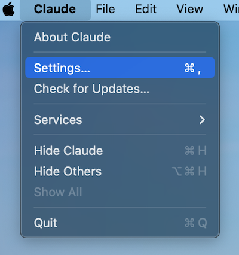
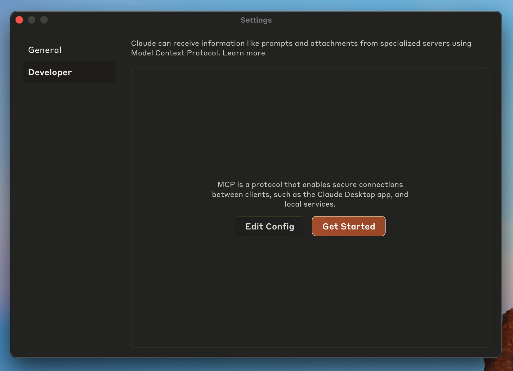
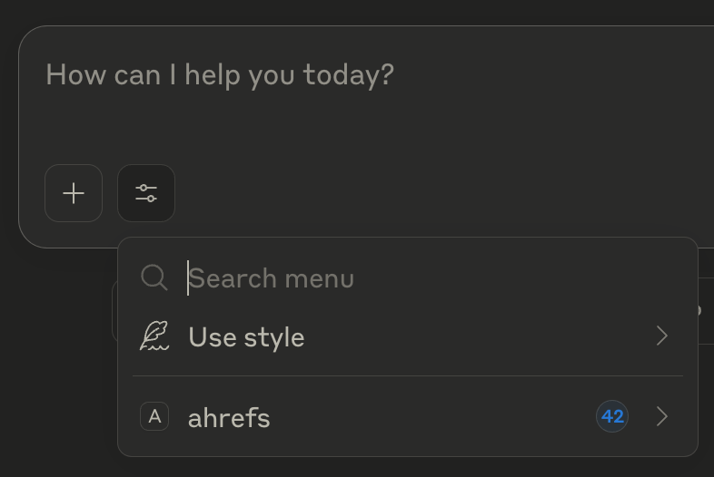

[](https://fastmcp.me/MCP/Details/857/ahrefs)
[](https://fastmcp.me/MCP/Details/857/ahrefs)
[](https://fastmcp.me/MCP/Details/857/ahrefs)
[](https://fastmcp.me/MCP/Details/857/ahrefs)
[](https://fastmcp.me/MCP/Details/857/ahrefs)
[](https://fastmcp.me/MCP/Details/857/ahrefs)

# Ahrefs MCP
A Model Context Protocol server to connect Claude desktop and other compatible AI assistants to Ahrefs.

## Installation
`npm` commands need to be executed in a terminal:
- macOS: open the Terminal from your Applications folder
- Windows: press Windows + R, type `cmd`, and press Enter
### Install Node.js and npm
1. Download Node.js from [nodejs.org](https://nodejs.org/en/download/)
2. Follow the installation instructions for your operating system
3. Verify installation by running:
```sh
npm -v
```
4. A version number will be printed if installation was successful

#### Windows Users
- When installing Node.js, use the official installer and make sure the folder is added to PATH when selecting installation options.

### Install Ahrefs MCP Server
```sh
npm install --prefix=~/.global-node-modules @ahrefs/mcp -g
```
### Upgrading versions
If you've installed our MCP server before, and just want to upgrade, run this command:
```sh
npm install --prefix=~/.global-node-modules @ahrefs/mcp@latest -g
```

## Configuration
You can now add the Ahrefs MCP to your favourite AI assistant app by adding the `ahrefs` part to your app's configuration file:
```json
{
    "mcpServers": {
        "ahrefs": {
            "command": "npx",
            "args": [
                "--prefix=~/.global-node-modules",
                "@ahrefs/mcp"
            ],
            "env": {
                "API_KEY": "YOUR_API_KEY_HERE"
            }
        }
    }
}
```

### Specific for Windows OS
```json
{
    "mcpServers": {
        "ahrefs": {
            "command": "npx",
            "args": [
                "--prefix=C:\\Users\\YOUR_USERNAME_HERE\\.global-node-modules\\node_modules",
                "@ahrefs/mcp"
            ],
            "env": {
                "API_KEY": "YOUR_API_KEY_HERE"
            }
        }
    }
}
```
1. Take note of the double escape backslashes
2. Take note that the prefix directory is slightly different
3. Take note of the forward slash for `@ahrefs/mcp`
4. If you are working with Claude Desktop, run Ctrl-Alt-Del to open Task Manager and kill Claude Desktop. Otherwise, your newly changed config will not be loaded.

To learn more about creating or controlling API keys, refer to the [official documentation](https://docs.ahrefs.com/docs/api/reference/api-keys-creation-and-management).
### Where to find the configuration file
#### Claude Desktop
1. Download Claude for Desktop
2. Select `Settings...`

<p align="center">
  
</p>

3. Click on `Developer` in the left panel, then `Edit Config`

<p align="center">
  
</p>

4. Paste the configuration [above](#configuration) into the open file

5. Restart the Claude app! If the installation is successful, it should look like this:

<p align="center">
  
</p>

If you prefer directly navigating to the file, the paths are:
- macOS: `~/Library/Application Support/Claude/claude_desktop_config.json`
- Windows: `%APPDATA%\Claude\claude_desktop_config.json`

If there are any issues, please refer to the [official documentation](https://modelcontextprotocol.io/quickstart/user)
#### Cursor
Cursor supports configurations that are either project-specific or global: the MCP configuration file will be at `.cursor/mcp.json` or `~/.cursor/mcp.json` respectively.
For more details, read the [official documentation](docs.cursor.com/context/model-context-protocol).

## Common Installation Issues & Fixes

### 1. Node.js or npm Not Installed / Recognized

**Symptoms:**
- Running `npm -v` shows an error like `command not found` or `'npm' is not recognized`.

**Fix:**
- Ensure you've installed Node.js from [nodejs.org](https://nodejs.org/en/download/).
- Restart your terminal after installation.
- On **Windows**, make sure the Node.js installer added `npm` to your PATH.

**Platform-Specific Checks:**
- **Windows:**
  Open Command Prompt (`Win + R → cmd`) and run:
  ```
  node -v
  npm -v
  ```
- **macOS/Linux:**
  Open Terminal and run:
  ```
  which node && which npm
  ```
If it returns nothing, Node.js may not be in your `$PATH`.

---

### 2. Permission Errors During Global Installation

**Symptoms:**
- Errors like `EACCES: permission denied`, especially on macOS or Linux.

**Fix:**
- Install using a user-scoped global prefix as shown in the installation guide:
  ```sh
  npm install --prefix=~/.global-node-modules @ahrefs/mcp -g
  ```
- This avoids requiring elevated privileges (`sudo`).

**Extra Tip:**
If you used `sudo` previously and created permission issues, reset folder ownership:
```sh
sudo chown -R $(whoami) ~/.global-node-modules
```
### 2a. macOS Terminal Permissions

**Symptoms:**
- Terminal shows "Operation not permitted" errors
- Unable to create folders or files
- Permission denied messages when running npm commands

**Fix:**
Check if Terminal has Full Disk Access:
  - Open System Settings (or System Preferences)
  - Go to Privacy & Security → Full Disk Access
  - Make sure Terminal.app is in the list and checked
  - If not present, click '+', navigate to Applications → Utilities → Terminal.app

**Note:**
Modern macOS versions require explicit permissions for Terminal access. Without proper permissions, npm installations and other file operations may fail silently or with permission errors.

---

### 3. `npx` Cannot Find the Ahrefs MCP Command

**Symptoms:**
- Error: `Cannot find package '@ahrefs/mcp'`

**Fix:**
Ensure your config uses the same prefix used during install:
```json
"command": "npx",
"args": [
  "--prefix=~/.global-node-modules",
  "@ahrefs/mcp"
]
```

**Note:**
Do **not** omit the `--prefix` unless you're installing globally system-wide (not recommended).

---

### 4. Configuration File Not Detected

**Symptoms:**
- Claude does not list the MCP under “tools”.

**Fix:**
- Make sure the config file path is correct:
  - **Windows:** `%APPDATA%\Claude\claude_desktop_config.json`
  - **macOS:** `~/Library/Application Support/Claude/claude_desktop_config.json`
  - **Linux:** (Rare, but if applicable) `~/.config/Claude/claude_desktop_config.json`
- Double-check you pasted the configuration **inside the correct section** and restarted Claude after saving.

---

### 5. API Key Problems

**Symptoms:**
- MCP fails silently or throws an error about `API_KEY`.
- Claude responds with a message that it ran into authentication issues.

**Fix:**
Ensure this line is present in the MCP config:
```json
"env": {
  "API_KEY": "YOUR_API_KEY_HERE"
}
```
Replace `YOUR_API_KEY_HERE` with your actual key. Ensure that your API key settings give you the necessary permissions.

For more help, refer to [Ahrefs API key docs](https://docs.ahrefs.com/docs/api/reference/api-keys-creation-and-management).

---

### 6. Path Expansion Issues

**Symptoms:**
- Error messages containing `ENOENT` or "no such file or directory"
- npm commands fail with path-related errors
- `~` or environment variables not being expanded correctly

**Fix:**
Use absolute paths instead of relying on path expansion:

**Windows:**
```sh
C:\Users\<username>\.global-node-modules
```
Replace `<username>` with your actual Windows username.

**macOS:**
```sh
/Users/<username>/.global-node-modules
```
Replace `<username>` with your macOS username.

**Linux:**
```sh
/home/<username>/.global-node-modules
```
Replace `<username>` with your Linux username.

**Example Configuration:**
```json
{
    "mcpServers": {
        "ahrefs": {
            "command": "npx",
            "args": [
                "--prefix=/Users/username/.global-node-modules",  // Replace with your absolute path
                "@ahrefs/mcp"
            ],
            "env": {
                "API_KEY": "YOUR_API_KEY_HERE"
            }
        }
    }
}
```

**How to Find Your Absolute Path:**

**Windows:**
1. Open Command Prompt
2. Type `echo %USERPROFILE%`

**macOS/Linux:**
1. Open Terminal
2. Type `echo $HOME`

**Note:**
Using absolute paths eliminates issues with path expansion and ensures the configuration works regardless of environment variables or shell configurations.

---

## 🧪 Diagnostic Commands Per Platform

| Issue | Windows Command | macOS/Linux Command |
|-------|-----------------|---------------------|
| Check Node version | `node -v && npm -v` | `node -v && npm -v` |
| Check if MCP is installed | `npm list -g --prefix=%USERPROFILE%\.global-node-modules @ahrefs/mcp` | `npm list -g --prefix=~/.global-node-modules @ahrefs/mcp`|
| Clear corrupted install | Delete folder manually | `rm -rf ~/.global-node-modules` |

---

## 📍 Summary of Key Paths

| Purpose  | Windows | macOS | Linux |
|----------|---------|-------|-------|
| Claude config file | `%APPDATA%\Claude\claude_desktop_config.json` | `~/Library/Application Support/Claude/claude_desktop_config.json` | `~/.config/Claude/claude_desktop_config.json` (if applicable) |
| Global MCP install location | `%USERPROFILE%\.global-node-modules` | `~/.global-node-modules` | `~/.global-node-modules` |

---

## 📘 Still Having Issues?

- Check the [official MCP documentation](https://modelcontextprotocol.io/quickstart/user)
- Or reach out to internal support at Ahrefs through your usual engineering support channel.

Let us know what errors you're seeing, along with your OS and the output of:
```sh
npm list -g --prefix=~/.global-node-modules @ahrefs/mcp
```
